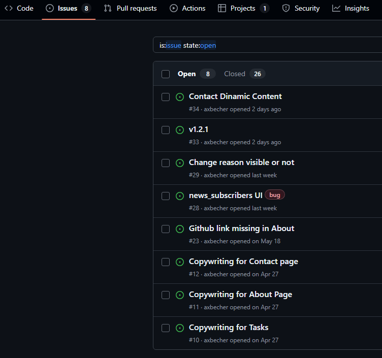
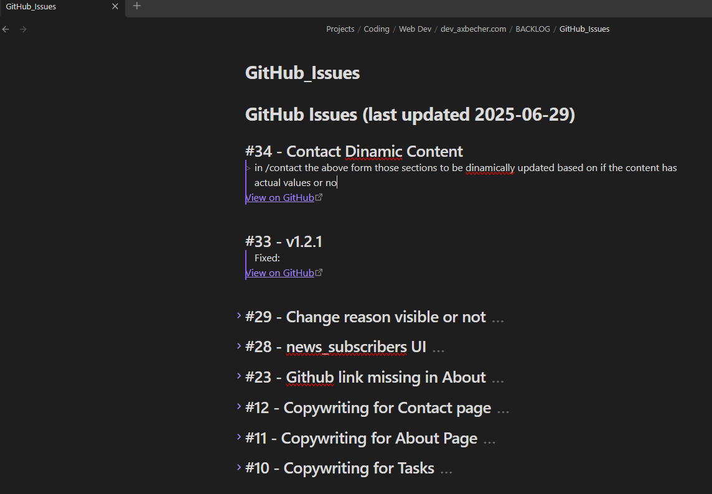

# 🧠 issue-sync-to-obsidian

Sync GitHub Issues to your Obsidian vault — as Markdown.

This simple Python utility pulls issues from a GitHub repository (including private ones) and writes them to a single Markdown file (GitHub_Issues.md) inside your local Obsidian vault. It updates the file only if changes are detected.

## 📚 Table of Contents

- [📁 Project Structure](#-project-structure)
- [🖼️ Screenshots](#️-screenshots)
- [⚙️ Setup](#️-setup)
- [▶️ Usage](#️-usage)
- [✅ Example Output](#-example-output)
- [🔒 .env Security](#-env-security)
- [🛠 Suggestions](#-suggestions)
- [🛡 License](#-license)
- [🤝 Contributor](#-contributor)
- [📬 Contact](#-contact)

---

## 📁 Project Structure

```
issue-sync-to-obsidian/
├── .env                # Your personal secrets (not committed)
├── .env_example        # A template for your .env file
├── .gitignore
├── run.py              # Launches test.py then main.py if passed
├── requirements.txt    # Dependencies list
├── README.md           # This file
└── src/
    ├── main.py         # Main script: fetches issues, writes to Markdown
    └── test.py         # Verifies .env values and setup before running
```

---

## 🖼️ Screenshots

### 📬 Issues in Github Repo Brwoser Preview
Here’s an example of issues from github repo:


### ⚙️ Issues in Obsidian formated as Markdown
This is how data formated as Markdown look in Obsidian:


---

## ⚙️ Setup

1. Clone the repository:

   ```bash
   git clone https://github.com/axbecher/issue-sync-to-obsidian.git
   cd issue-sync-to-obsidian
   ```

2. Install dependencies:

   ```bash
   pip install -r requirements.txt
   ```

3. Create a .env file using the example:

   ```bash
   cp .env_example .env
   ```

4. Fill in your .env file:

   ```
   GITHUB_TOKEN=ghp_yourgithubtokenhere
   REPO=username/repository-name
   VAULT_PATH=/absolute/path/to/your/obsidian/vault
   ```

   📌 Notes:
   - GITHUB_TOKEN should be a GitHub personal access token (PAT) with repo scope if the repository is private.
   - REPO must follow username/repository-name format (no URLs).
   - VAULT_PATH should be the full path to your local Obsidian vault folder.

---

## ▶️ Usage

To safely run the main script:

```bash
python run.py
```

run.py executes test.py first to check:

- Environment variables are defined
- REPO is in the correct format
- GitHub token and repository are valid
- Obsidian VAULT_PATH exists and is a folder

Only if all checks pass, main.py will run and update your vault file.

---

## ✅ Example Output

File: ObsidianVault/GitHub_Issues.md

```markdown
# GitHub Issues (last updated 2025-06-29)

## #12 - Fix login bug
> Resolves session timeout when using 2FA.
[View on GitHub](https://github.com/axbecher/issue-sync-to-obsidian/issues/12)

## #11 - Add search filter
> Add a search bar to filter dashboard entries.
[View on GitHub](https://github.com/axbecher/issue-sync-to-obsidian/issues/11)
```

---

## 🔒 .env Security

Always exclude your .env file from commits. This project includes a .gitignore entry to prevent that automatically. Use .env_example for sharing the structure safely.

---

## 🛠 Suggestions

- Schedule run.py using cron (Linux/macOS) or Task Scheduler (Windows)
- Customize it to fetch only open issues, or with certain labels
- Extend to sync PRs, milestones, or even write per-issue files

---

## 🛡 License

MIT License — open to use, modify, and distribute.

---

### 🤝 Contributor
<table>
  <tbody>
    <tr>
      <td align="center"><a href="https://axbecher.com"><br /><sub><b>Alexandru Becher</b></sub></a><br />
      </td>
    </tr>
  </tbody>
</table>

## 📬 Contact
For questions or improvements, feel free to open an [issue](https://github.com/axbecher/issue-sync-to-obsidian/issues) or [PR](https://github.com/axbecher/issue-sync-to-obsidian/pulls).